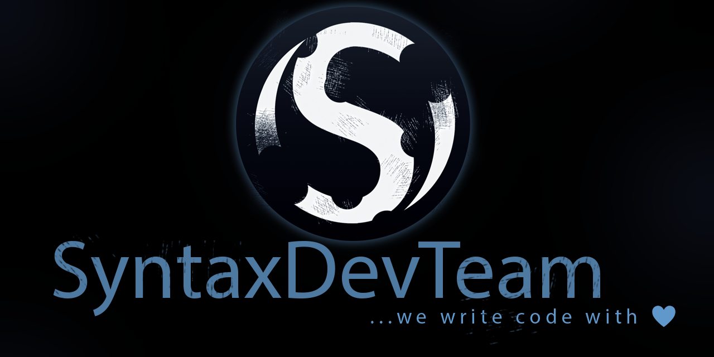

# Welcome to SentinelX
SentinelX is a modern plugin for Minecraft servers, whose main task is to censor chat in automatic mode by replacing profanity with their censored versions or completely removing selected words.

## Information
* [x] SentinelX was designed specifically for (currently) the latest version of Minecraft 1.21
* [x] Optimized for Bukkit/Spigot and Paper engines (choose the appropriate version for your server)
* [x] Requires Java 21 or newer to work correctly
* [x] Written in the modern programming language Kotlin, which is more expressive and safer than Java.

If you have any questions, you might find a solution on our discord

## Installation
* Download the latest version of the plugin from the releases section.
* Place the JAR file in the plugins folder on your server.
* Start the Minecraft server.
* Configuration In the config.yml file, you will find configuration options such as the list of banned words or full censorship mode.
 
## Contact
If you have questions or need help, feel free to contact us on our [discord](https://discord.gg/KNstae3UEV) or write directly on PM

## License
This plugin is available under the MIT license. Details can be found in the LICENSE file.

Thank you for using SentinelX! I hope it meets your expectations. 😊

Polska wersja README?

# SentinelX

SentinelX to nowoczesny plugin dla serwerów Minecraft, którego głównym zadaniem jest cenzurowanie czatu w trybie
automatycznym przez zamianę wulgaryzmów w ich wersje ocenzurowane bądź też całkowicie usuwając wybrane słowa.

## Informacje
* [x] SentinelX został zaprojektowany specjalnie pod (obecnie) najnowszą wersję Minecraft 1.21
* [x] Zoptymalizowano pod silniki Bukkit/Spigot i Paper (wybierz odpowiednią wersję dla swojego serwera)
* [x] Wymaga Javy 21 lub nowszej, aby działać poprawnie
* [x] Napisany w nowoczesnym języku programowania Kotlin, który jest bardziej ekspresyjny i bezpieczny niż Java.

Jeśli masz jakieś pytania, być może znajdziesz na nie rozwiązanie na naszym [discordzie](https://discord.gg/KNstae3UEV)

## Instalacja
  * Pobierz najnowszą wersję pluginu z sekcji wydań.
* Umieść plik JAR w folderze plugins na swoim serwerze.
* Uruchom serwer Minecraft.
* Konfiguracja
W pliku config.yml znajdziesz opcje konfiguracyjne, takie jak listę zakazanych słów czy tryb pełnej cenzury.

## Kontakt
  Jeśli masz pytania lub potrzebujesz pomocy, śmiało skontaktuj się z nami na naszym [discordzie](https://discord.gg/KNstae3UEV) lub napisz bezpośrednio na PM 

## Licencja
  Ten plugin jest dostępny na licencji MIT. Szczegóły znajdziesz w pliku LICENSE.

Dziękuję za korzystanie z SentinelX! Mam nadzieję, że spełni twoje oczekiwania. 😊

